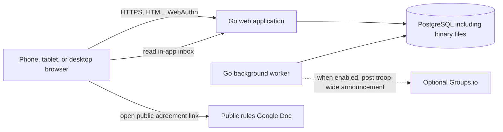
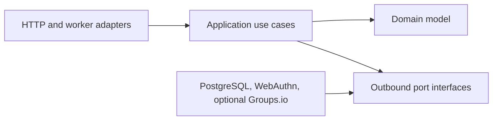

# Troop 900 Tree Lot Shift Scheduler

## System Architecture

**Status:** Proposed baseline  
**Date:** July 2026  
**Related requirements:** [Use Cases](use-cases.md), [Logical UI/UX Design System](design-system-requirements.md)

## 1. Purpose and scope

This document defines the technical architecture for the Troop 900 Tree Lot Shift Scheduler. It translates the use cases and business rules into an implementation and deployment approach.

The system is a small, security-sensitive web application for approximately 40–50 people in 15–20 households. Although expected traffic is low, scheduling concurrency, seasonal agreement confirmations, attendance records, authentication, privacy, and outbound communications require the same correctness and auditability as a larger application.

The architecture is intentionally a **modular monolith** using **hexagonal architecture** and **domain-driven design (DDD)**. This keeps deployment and operations simple while isolating business rules from web, database, messaging, and hosting concerns.

## 2. Architecture drivers

The design is driven by the following requirements:

- All user workflows run in a responsive web browser.
- The backend is written in Go and renders HTML on the server.
- HTMX progressively enhances the interface; browser JavaScript is required for passkeys (WebAuthn) and may be required for other browser APIs.
- Heavy client-side frameworks such as React or Angular are not used.
- Passwordless access uses passkeys bound to authenticated identities that claim a system-wide-unique email account identifier.
- Enrollment and recovery use authorized invitation links or QR codes rather than SMS authentication codes.
- Authorization is relationship-aware. It cannot be represented by a single flat role check.
- Scouts can belong to multiple households while retaining one person profile and one schedule.
- Confirmation of the season's linked conduct agreement is person- and season-specific and gates participation.
- Shift capacity and duplicate-assignment rules must hold under concurrent requests.
- Attendance events and administrative corrections require a durable audit trail.
- Operational notifications are recorded in each authenticated user's in-app inbox with private read/unread state. An optional deployment-time Groups.io integration may post troop-wide announcements. Direct and family-scoped messages remain in-app only. A later verified-email channel may optionally supplement the inbox after mailbox verification and user opt-in.
- Personal data, profile photos, account emails, and agreement confirmations require restricted access and an explicit deletion lifecycle.
- The expected user base and budget do not justify microservices, Kubernetes, Redis, or a client-side application framework.

## 3. Technology decisions

### 3.1 Application

- **Language:** Go, using a supported release pinned in `go.mod`
- **HTTP server:** Go `net/http`; a small compatible router may be used if it improves route composition
- **HTML rendering:** Go `html/template`
- **Progressive enhancement:** HTMX for targeted partial-page updates
- **Browser code:** Focused JavaScript for required browser APIs—especially WebAuthn passkey registration/assertion—and small enhancements such as image selection and cropping. No client-side application framework.
- **Styling:** Tailwind CSS compiled into an application-owned static stylesheet
- **Database access:** `pgx` with `sqlc`-generated, type-safe queries
- **Schema migrations:** Versioned SQL migrations executed as a production pre-deploy step
- **Logging:** Structured JSON logs using Go's `log/slog`
- **Configuration:** Environment variables parsed into one validated configuration structure at startup

Tailwind scans Go templates and browser code at build time and emits a minified, content-pruned CSS asset. The Tailwind toolchain is pinned and runs during local development and the Docker build; Node.js is not present in the production image or runtime. Shared template components and a small set of design tokens should provide consistent controls, status colors, spacing, and typography without hiding semantic HTML or accessibility behavior.

The application should prefer Go's standard library and a small number of focused dependencies. A full ORM, dependency-injection framework, or client-side application framework would obscure domain rules without providing meaningful value at this scale.

### 3.2 Data and external services

- **System of record:** PostgreSQL
- **Binary-file persistence:** PostgreSQL `BYTEA` behind a storage port
- **Authentication:** WebAuthn/passkeys implemented in the Identity module; no SMS authentication provider
- **In-app notifications:** Communications records every recipient-facing notice in a personal inbox with private read state
- **Optional troop group announcements:** Groups.io API through a dedicated adapter, disabled by default
- **Future verified email (not initial):** After mailbox verification and user opt-in, selected notifications may also be emailed; unverified claimed email is never used for delivery
- **Rules-of-conduct document:** Public Google Doc maintained outside the application
- **Season archive encryption:** Passphrase-based `age` encryption around a checksummed ZIP
- **Background work:** A Go worker using PostgreSQL-backed jobs and a transactional outbox
- **Production hosting:** Render

Authentication never depends on SMS providers. Notification delivery uses the in-app inbox and optional Groups.io without changing passkey authentication.

## 4. System context



The browser communicates with the Go web application, performs WebAuthn ceremonies with that origin, and opens the public agreement document directly on Google Docs. It never connects directly to PostgreSQL or Groups.io. The application stores the Google Doc URL but does not fetch its contents.

## 5. Software architecture

### 5.1 Modular monolith

The web process and worker are two entry points built from the same Go codebase and domain modules. They may be compiled as one binary with subcommands or as two small binaries. They share a database, but all data access remains behind module-owned repositories.

This is not a distributed microservice architecture. Module boundaries are code and ownership boundaries, not network boundaries. A single database transaction can therefore preserve invariants that span closely related aggregates.

The recommended top-level layout is:

```text
cmd/
  web/                 HTTP server entry point
  worker/              asynchronous job processor
  migrate/             required schema-migration entry point
  restore-season/      offline archive validation and restoration
internal/
  identity/
  families/
  agreements/
  scheduling/
  attendance/
  communications/
  reporting/
  privacy/
    platform/
      postgres/
      blobstore/
      webauthn/
      groupsio/
      clock/
  web/
    handlers/
    middleware/
    views/
    templates/
migrations/
web/
  static/
```

Package names may evolve, but dependencies must follow the boundaries below.

### 5.2 Hexagonal architecture

Each domain module is organized around the following concepts:

- **Domain:** Aggregates, entities, value objects, domain services, policies, and domain events. It contains business behavior and no HTTP, SQL, WebAuthn wire details, Groups.io, or Render code.
- **Application:** Use-case orchestration, commands, queries, transaction boundaries, authorization context, and ports required by the use case.
- **Inbound adapters:** HTTP handlers, form decoding, HTMX/full-page response selection, worker job handlers, and administrative commands.
- **Outbound adapters:** PostgreSQL repositories, binary-file persistence, WebAuthn ceremony support, optional Groups.io, clock, ID generation, and structured audit persistence.

Dependency direction points inward:



Port interfaces should be declared by the module that consumes them. For example, the Identity application layer defines a `PasskeyCeremony` port, and the communications application layer defines an `InboxPublisher` port for in-app messages plus an optional `GroupAnnouncementPoster` port implemented by the Groups.io adapter when enabled.

HTTP handlers must not contain business rules. They:

1. Decode and validate the request shape.
2. Resolve the authenticated actor.
3. Invoke one application command or query.
4. Translate the result to a full page, HTMX fragment, redirect, or error response.

The application layer and domain model enforce the same rules regardless of the response format.

### 5.3 Domain-driven design boundaries

The initial bounded contexts are:

#### Identity and Access

Owns authenticated identities, claimed email account identifiers, passkey credential records, WebAuthn ceremony orchestration, browser sessions, role grants, bootstrap administration, invitation tokens, access removal, and account recovery.

Important distinction: an authenticated identity is not a person profile. One identity links to one person and may carry multiple application roles. Email identifies the account; passkeys authenticate it. Email mailbox verification is deferred until notifications or email-based recovery require it.

#### Families

Owns people, households, household memberships, manager authority, scout household links, family units, adult-to-scout relationships, profile details, and household activation status.

One person can belong to multiple households. Household is the operational management boundary; family unit is a reporting boundary.

#### Seasonal Agreements

Owns the public Google Doc URL selected for each season and each participant's boolean confirmation that they have read and agree to the linked rules of conduct. The application does not upload, copy, render, version, sign, or retain the document itself.

The Google Doc is outside the system boundary. The application never fetches it, only accepts an HTTPS URL on the approved Google Docs host and renders that URL as an external link. It cannot detect edits made at the same URL or prove what content a person viewed. Troop leadership is responsible for publishing the intended document. If the applicable rules change, an Admin must replace the season's configured link; doing so resets every confirmation for that season.

Participation eligibility is exposed as a domain policy/query to scheduling and attendance. Those modules must not reproduce agreement-confirmation logic.

#### Scheduling

Owns seasons, shift templates, generated shifts, publication, capacity requirements, assignments, assignment ownership, cancellations, staffing status, and schedule navigation.

Capacity and duplicate prevention are transactional invariants, not UI behavior.

#### Attendance

Owns check-in and checkout events, walk-ins, no-show state, timing windows, attendance adjustments, corrected hours, and actor attribution.

Raw real-time events are immutable. Corrections are separate records that affect reported hours without rewriting history.

#### Communications

Owns canonical announcements, the per-user in-app inbox, recipient resolution, personal read state, delivery records, notification preferences, reminders, channel-specific delivery attempts, and retries.

Identity authenticates locally with WebAuthn/passkeys and does not send authentication SMS. Communications records every recipient-facing notice in the in-app inbox. Troop-wide announcements may also post through the optional Groups.io adapter. Direct and family-scoped messages stay in-app only. A later verified-email dispatcher may supplement the inbox after mailbox verification and opt-in.

#### Reporting

Owns read models and calculations for individual hours, household/family-unit totals, leaderboards, season statistics, Scout Bucks credited hours, finalized seasonal dollar awards, and CSV exports.

Reporting consumes authoritative records from the other contexts. It does not own assignments or attendance.

Scout Bucks has two explicitly different measures:

- **Credited hours** are provisional during the season. They combine each scout's own hours with allocated shares of associated adults' hours.
- **Dollar awards** do not exist until attendance and relationships are finalized and the Treasurer enters the season's distributable profit pool after expenses and hold-backs.

The system divides the complete distributable pool among scouts in proportion to finalized credited hours. It calculates from integer cents and full-precision credited hours, then uses a deterministic largest-remainder allocation for leftover cents so finalized awards sum exactly to the entered pool. The displayed dollars-per-credit-hour rate is informational, not the source of truth.

Finalization creates an immutable, revisioned settlement containing the pool, credited-hour snapshot, calculation results, rounding allocation, actor, and timestamp. A correction requires an audited new revision rather than editing a finalized result. The application displays and exports the final seasonal awards but does not maintain ongoing Scout Bucks balances, trip or dues redemptions, transfers, or a financial ledger.

#### Privacy and Audit

Owns append-only audit entries, data-export orchestration, erasure/anonymization workflows, data-lifecycle policies, and non-identifying proof that a privacy request was fulfilled.

### 5.4 Aggregate and transaction guidance

Likely aggregate boundaries include:

- `AuthenticatedIdentity`
- `PasskeyCredential`
- `Invitation`
- `Household`
- `Person`
- `SeasonAgreement`
- `AgreementConfirmation`
- `Season`
- `Shift`
- `AttendanceRecord`
- `Announcement`
- `ScoutBucksSettlement`

Aggregates should remain small. Historical collections such as all assignments or all attendance records must not be loaded into one in-memory root.

Use one PostgreSQL transaction for each command that changes domain state. The same transaction should:

1. Lock or conditionally update the records that protect the invariant.
2. Persist domain changes.
3. Append audit data.
4. Insert any resulting outbox messages.
5. Commit before external network calls occur.

Enabled Groups.io network calls, and any future email-provider calls, must not run while a database transaction is open. In-app inbox records are written in the same transaction as the domain change.

## 6. Persistence

### 6.1 PostgreSQL as the source of truth

PostgreSQL stores:

- Identities, claimed email identifiers, email verification state, passkey public-key credential records, roles, and sessions
- Invitations, recovery enrollment tokens, and household link tokens
- Person profiles, households, memberships, and family units
- Seasons, templates, shifts, assignments, and assignment ownership
- Seasonal agreement links, per-person confirmation booleans, confirmation timestamps, and acting identities
- Attendance events, adjustments, no-show status, and calculated/reportable hours
- Scout Bucks credited-hour snapshots and finalized settlement revisions
- Inbox messages, announcements, per-user read state, notification preferences, delivery attempts, and provider identifiers
- Transactional outbox entries and background jobs
- Audit entries, privacy requests, and retention state

Relational storage is the correct fit because the system has strong relationships, uniqueness rules, multi-record transactions, reporting joins, and concurrency-sensitive capacity constraints.

All timestamps are stored as UTC instants. Season dates, shift entry, schedule display, reminder calculation, and attendance-window presentation use one deployment-configured IANA time zone for the tree-lot location. The required `TREE_LOT_TIME_ZONE` environment variable contains an IANA identifier such as `America/Los_Angeles`; startup fails if it is missing or invalid. Domain code receives that zone and an injected clock explicitly; it must not depend on the host machine's local time. Daylight-saving transitions are resolved when local shift times are converted to instants, and the original local date, local time, and zone remain available for display and audit.

### 6.2 Database invariants

Important rules should be protected by database constraints in addition to domain validation:

- Normalized active login email is unique system-wide.
- Passkey credential IDs are unique for the relying party.
- A person can have at most one assignment per shift.
- Membership and role foreign keys cannot reference missing identities, people, or households.
- An agreement confirmation is unique per person and season and applies only to the season's current configured link.
- Checkout cannot precede check-in.
- Outbox idempotency keys and provider delivery identifiers are unique where applicable.

Shift signup must use a transaction with row locking or a conditional update so two concurrent requests cannot consume the same final slot. Checking capacity in one query and inserting later without a lock is not safe.

### 6.3 Sessions and sensitive values

Browser sessions use opaque, cryptographically random tokens stored in `Secure`, `HttpOnly`, and `SameSite=Lax` cookies. PostgreSQL stores only a cryptographic hash of each session token, along with identity, creation, expiry, last-use, and revocation metadata.

Invitation, household-link, recovery, bootstrap, and idempotency tokens are also random, expire, are single-use where required, and are stored hashed when the clear value does not need to be recovered.

Account emails are normalized before comparison and stored for account identification and later notification/recovery use. Maintain uniqueness with a normalized unique index or keyed blind index as appropriate. Passkey private keys never leave the authenticator; PostgreSQL stores only public-key credential material, credential IDs, sign-count/metadata, and the owning identity. The system does not store phone numbers for authentication or operational notification delivery.

### 6.4 Binary-file persistence

The initial implementation stores profile photos in PostgreSQL `BYTEA` columns. This is a deliberate scale-based compromise: dedicated object storage has better cost, lifecycle, delivery, and backup characteristics, but the expected number and size of files do not initially justify another production service, credential set, local dependency, and failure mode.

Binary data is isolated in dedicated tables rather than added to person or other frequently queried rows. Each stored file has an opaque application ID plus media type, byte length, checksum, owner reference, creation time, and deletion state. List and reporting queries never select file bytes.

- PostgreSQL `BYTEA` is used; PostgreSQL Large Objects are not used because their separate lifecycle makes authorization, deletion, backup, and orphan cleanup harder.
- Profile images are resized, re-encoded, and stripped of unnecessary metadata before storage, with an initial maximum stored size of 500 KiB.
- Uploads enforce declared and detected media types, size limits, and file-signature validation.
- Downloads pass through an authorized application endpoint with safe content-disposition and cache headers.
- File deletion and privacy workflows remove the bytes and metadata in one transaction.
- PostgreSQL backups include the binary data, giving one consistent restore point but increasing backup size and restore time.

Application modules depend on a `BlobStore` port with operations based on opaque file IDs; they do not know whether bytes are held in PostgreSQL. The initial PostgreSQL adapter implements that port. If file volume, database cost, backup duration, or delivery requirements outgrow this choice, an S3-compatible adapter can be introduced without changing domain APIs or persisted owner references. Migration would copy verified bytes to object storage, update storage-location metadata, and retain dual-read capability until checksums and backups are validated.

Total binary volume, database growth, backup duration, and restore duration are monitored and reviewed after every season. Moving to dedicated object storage is an operational migration trigger, not a domain redesign.

### 6.5 Manual season archive and deletion

Completed seasons remain in the live application indefinitely unless an administrator manually archives and deletes one. There is no age-based purge, retention scheduler, or automatic season deletion.

Archival and deletion are separate, ordered operations:

1. An administrator selects a completed, inactive season and requests an archive.
2. The application creates a consistent, versioned archive containing the season definition, configured agreement link and confirmation records, generated shifts, assignments, attendance and adjustments, season-scoped messages and delivery state, reporting inputs, finalized Scout Bucks settlement revisions, and the minimum person/household reference snapshots needed to interpret them. The external Google Doc contents are not included.
3. The application produces a ZIP containing a machine-readable manifest, versioned JSON or CSV data files, record counts, creation timestamp, and SHA-256 checksums.
4. The administrator enters and confirms an archive passphrase. The application uses passphrase-based `age` encryption to produce `season-{name}.zip.age`; it never logs, stores, or transmits the passphrase elsewhere.
5. The administrator downloads the encrypted archive and confirms that it and the passphrase have been saved separately. The application verifies archive generation and checksum completion before enabling deletion.
6. A separate deletion screen shows exact record counts, explains that deletion cannot be undone without both the external archive and its passphrase, requires a recent passkey step-up, and requires the administrator to type the season name.
7. One database transaction deletes all data owned exclusively by that season. Shared identities, people, households, family units, reusable templates, and roles remain because they are not season-owned.
8. A minimal non-personal deletion receipt records the acting administrator, deletion time, former season ID, archive checksum, and deleted record counts. It contains no participant, agreement, attendance, or message content.

Deletion removes the season from ordinary and administrative application views, reports, and searches. The encrypted archive remains the troop's responsibility. The passphrase must be stored separately in a troop-controlled password manager; losing it makes the archive unrecoverable. Provider-managed database backups may contain the prior database state until their normal backup lifecycle expires, but the application cannot query or restore that data as a deleted season without an explicit disaster-recovery or archive-restore operation.

The archive generator and restore command are versioned with the application and covered by round-trip tests. The restore command prompts for the passphrase, decrypts the `age` envelope, verifies the ZIP and manifest checksums, and then restores the season. A release must retain the ability to read archive versions it has produced or provide an offline migration tool before dropping that compatibility.

## 7. Authentication and authorization

### 7.1 Passkey enrollment and sign-in

**Enrollment (bootstrap, household, co-manager, or Young Adult Scout invitation):**

1. The browser presents a single-use invitation or bootstrap token.
2. The server validates the token, purpose binding, expiry, and rate limits without revealing unrelated account details.
3. The person claims an email address; the server normalizes it and enforces active uniqueness.
4. The Identity application service begins a WebAuthn registration ceremony and returns public options to the browser.
5. The browser completes passkey creation; the server verifies the attestation/registration response and stores the public credential on the authenticated identity.
6. The email remains unverified. The server creates a local browser session and consumes the invitation or bootstrap token.

**Sign-in:**

1. The browser preferably performs a discoverable-credential (usernameless) WebAuthn assertion for the site's relying-party ID.
2. When an account hint is needed, the person may enter their claimed email first; responses remain generic with respect to account existence.
3. The server verifies the assertion against stored public-key material and sign-count/metadata.
4. On approval, the server resolves the existing identity and creates a local browser session.
5. Security-sensitive actions require a recent passkey step-up timestamp.

The application never learns passkey private keys. Bootstrap uses a configured one-time enrollment token secret. The bootstrap path succeeds only when no administrator exists and permanently closes after the first administrator is created.

### 7.2 Authorization

Authorization is evaluated in application services using:

- Authenticated identity and active roles
- Linked person profile
- Household memberships and manager authority
- Assignment origin/ownership
- Target person's role and active status
- Season and agreement-confirmation eligibility
- Shift status, capacity, and timing windows
- Whether an override is allowed and must be audited

Templates may hide controls for usability, but every command repeats authorization on the server. HTMX headers and client-submitted person or household IDs are never trusted as authority.

## 8. Notification and announcement delivery

### 8.1 Channel separation

Authentication is not a notification-delivery concern:

- **Identity / WebAuthn** handles authentication, invitation acceptance, re-authentication step-up, and recovery enrollment.
- **In-app inbox** is the required channel for every authenticated recipient. It stores announcements, reminders, staffing notices, closures, and other operational messages with private read/unread state.
- **Optional Groups.io** may receive troop-wide announcements only when enabled.
- **Future verified email** may optionally supplement the inbox after mailbox verification and user opt-in; it never replaces inbox records or private read state.

Invitation links and QR codes are issued by the application and delivered out of band. The system does not use SMS authentication codes or SMS for operational notifications. Direct and family-scoped messages remain in-app only.

### 8.2 Reliable delivery

Commands that create recipient-facing notices write inbox records in the same transaction as the domain change. Commands that also require an external channel write an outbox record in that same transaction. A background worker claims pending outbox records using bounded batches and PostgreSQL `FOR UPDATE SKIP LOCKED`, then calls the relevant provider.

Each external delivery record contains:

- Message type and canonical content reference
- Recipient identity or group destination as appropriate
- Channel and provider
- Stable idempotency key
- Attempt count and next-attempt time
- Provider message identifier
- Current status and status timestamps
- Sanitized failure category

Transient failures retry with exponential backoff and jitter. Permanent failures remain visible to authorized committee members. Retrying a failed external delivery targets only the failed channel and reuses the logical idempotency key.

### 8.3 Groups.io

Groups.io is a nice-to-have deployment option, not a required system capability. `GROUPS_IO_ENABLED` defaults to `false`. When disabled, no Groups.io credentials are required, no Groups.io controls or delivery status are shown, and no Groups.io network calls or jobs are created.

When enabled, the adapter posts troop-wide canonical announcements using a dedicated API credential with only the required group permissions. Startup requires and validates the group identifier and credential only in this mode. The adapter encapsulates the draft-and-post API workflow so Groups.io API changes do not affect the domain or application layers.

Groups.io delivery status is tracked independently from in-app inbox publication. A Groups.io failure does not roll back successful inbox publication, and inbox publication does not depend on Groups.io. Direct and family-scoped messages never create Groups.io jobs.

If API access proves unsuitable during implementation, the same port may be implemented with a Groups.io email-integration address. That fallback provides weaker confirmation of the final group post and must be documented if selected.

## 9. Background processing

One worker process handles:

- Transactional outbox delivery
- Retry scheduling
- Approximately 24-hour shift reminders
- Optional agreement-confirmation reminders
- Binary-record cleanup after privacy actions
- Long-running exports and reports

PostgreSQL is sufficient as the queue at this scale. A separate Redis deployment would increase operational complexity without solving a current requirement.

Jobs use stable deduplication keys such as `shift-reminder:{assignment-id}:{scheduled-window}`. Worker handlers must be safe to run more than once. Job leases expire so another worker can recover work after a crash.

A Render cron job runs hourly and enqueues time-based work; it does not send messages directly. The worker performs recipient resolution and delivery. This keeps retries, deduplication, and audit behavior consistent.

## 10. Web delivery

The Go server renders complete HTML pages. HTMX requests may receive fragments from the same view-model and application-query path.

- `GET` requests are side-effect free.
- State changes use `POST`, `PUT`, or `DELETE` semantics as appropriate and include CSRF protection.
- Successful form submissions use Post/Redirect/Get unless an HTMX fragment response is more appropriate.
- User-facing validation errors are safe and specific; authentication and email-conflict responses avoid account enumeration.
- Passkey ceremonies require JavaScript and a supported WebAuthn implementation in Chrome or Safari on the supported matrix.
- Templates receive purpose-built view models, not persistence records.
- All pages meet responsive and keyboard-accessibility requirements.

### 10.1 Small design system

The application maintains a small design system built from Tailwind tokens and reusable Go template components. It is part of the web application rather than a separately deployed package or JavaScript component library.

The design system includes:

- **Foundations:** Color, typography, spacing, sizing, border, shadow, focus-ring, and responsive-breakpoint tokens
- **Primitives:** Buttons, links, inputs, selects, checkboxes, radio groups, badges, alerts, cards, dialogs, tables, pagination, and empty states
- **Layout patterns:** Page shell, navigation, content sections, form layouts, filter bars, and responsive roster/schedule layouts
- **Domain patterns:** Shift card, staffing indicator, agreement-status panel, person selector, attendance row, announcement item, and delivery-status summary
- **Interaction states:** Default, hover, focus, active, disabled, loading, validation error, success, warning, and destructive confirmation

Tokens are defined once in the Tailwind theme and exposed through semantic component variants such as `primary`, `critical`, `complete`, and `understaffed`. Domain meaning must not rely on color alone; text, icons, and accessible labels carry the same status.

Components render semantic HTML and own their accessibility contract, including labels, descriptions, keyboard behavior, focus management, and ARIA only where native semantics are insufficient. HTMX behavior enhances these components while sharing the same server-side authorization and validation path. Passkey and other browser-API flows may require JavaScript; they still submit attested results to server-validated commands.

A development-only component gallery renders every component, variant, viewport-sensitive layout, and interaction state using representative tree-lot content. It serves as living documentation and supports automated accessibility checks and focused visual-regression tests. Production builds do not expose the gallery.

New visual patterns should first reuse or extend an existing component. The system should stay deliberately small: a component is added only when it represents repeated behavior or a stable domain concept, not merely to wrap one occurrence of markup.

### 10.2 Browser and accessibility support

The supported browser matrix is intentionally narrow:

- Google Chrome: current and previous major versions on Android and desktop
- Safari: current and previous major platform versions on iOS, iPadOS, and macOS

Chrome on Android and Safari on iOS are the primary acceptance targets. Other standards-based browsers may work, but Firefox, Edge, Samsung Internet, and embedded web views are not release-gating support targets.

Core workflows meet WCAG 2.2 Level AA. Acceptance includes keyboard-only operation, visible focus, semantic labels and errors, sufficient contrast, text zoom, reduced-motion behavior, and screen-reader announcements for dynamic HTMX updates. Automated accessibility checks run in CI, with manual VoiceOver testing in Safari and TalkBack testing in Chrome before each tree-lot season.

There is no public JSON API in the initial scope. Provider webhooks and health endpoints are narrow infrastructure endpoints, not a general application API.

## 11. Local development with Docker Compose

Docker Compose provides a reproducible local environment with:

- `app`: Go web application with live reload when desired
- `assets`: Tailwind compiler in watch mode for local template and style changes
- `worker`: The same codebase running the job worker
- `postgres`: PostgreSQL with a named volume and health check
- `provider-stubs`: Controllable HTTP substitutes for optional Groups.io interactions used by acceptance tests
- `acceptance`: A profile-only runner for the executable acceptance-test suite

The required migration entry point is the only process permitted to apply schema migrations. Web and worker startup validate schema compatibility but never mutate the schema. Locally, developers run the migration command explicitly after PostgreSQL becomes healthy and before starting application processes; production invokes the same entry point as its pre-deploy command.

Local messaging adapters do not contact real users. In-app inbox messages are visible through the ordinary Inbox view. Passkey ceremonies use deterministic WebAuthn test authenticators or browser automation. Groups.io remains disabled unless a developer explicitly enables its stub or sandbox configuration. Integration tests can instead run against deterministic in-memory fakes.

Recommended local commands are:

```sh
docker compose up --build
docker compose run --rm app migrate up
docker compose run --rm app test
docker compose --profile acceptance run --rm acceptance
docker compose down
```

Exact commands should be added to the repository README when the Compose and build files are implemented.

Local `.env` files are ignored by Git. A committed `.env.example` documents variable names using non-secret values.

## 12. Production deployment

### 12.1 Target topology

Production targets Render in one region:

- One Docker **web service** running the Go HTTP server
- One Docker **background worker** built from the same image
- One hourly **cron job** that enqueues scheduled work
- One paid **Render PostgreSQL** database, including binary-file persistence, with automated backups and point-in-time recovery
- Optional Groups.io API integration, disabled by default

The canonical production origin is **`https://treelot.troop900livermore.org`**. The troop retains ownership of `troop900livermore.org`, and the existing marketing site at `https://www.troop900livermore.org` remains independently hosted and unchanged.

Troop-managed DNS points the `treelot` hostname to the Render web service using the record type and target supplied by Render. Render terminates TLS and automatically manages the certificate for the scheduler hostname. The application redirects any Render-provided hostname to the canonical origin.

Session cookies are host-only for `treelot.troop900livermore.org`; they must not set `Domain=troop900livermore.org`. This prevents scheduler credentials from being sent to the marketing site or future sibling subdomains. The WebAuthn relying-party ID and origin must match this canonical host. Invitation links and outbound announcement links are generated from one validated `PUBLIC_BASE_URL` set to the canonical HTTPS origin.

The web service listens on `0.0.0.0:$PORT`. The database and services are colocated in the same Render region.

The same immutable image is promoted between environments. Configuration and secrets differ by environment; code does not.

### 12.2 Deployment sequence

1. CI runs formatting, static analysis, domain, application, persistence, and adapter tests.
2. CI builds the production Docker image once.
3. CI deploys that image, PostgreSQL, and controllable provider stubs into an isolated production-like acceptance environment.
4. The executable acceptance-test suite verifies the deployed system through its public interfaces.
5. Render promotes the same tested image to production.
6. A pre-deploy command applies forward-compatible database migrations once.
7. Render replaces web and worker instances.
8. Health checks must pass before the web deployment receives traffic.
9. Destructive schema cleanup occurs only in a later deployment after old code is no longer running.

Acceptance deployment is a rehearsal of production deployment. No image is rebuilt or modified after acceptance. The expand-and-contract migration approach supports zero-downtime deployment and rollback of application code.

### 12.3 Production configuration

Secrets include:

- Database connection string
- Cookie/session signing or encryption keys
- Email uniqueness / blind-index keys when used
- Bootstrap administrator enrollment token
- Groups.io API credential and group identifier, only when `GROUPS_IO_ENABLED=true`
- Break-glass recovery configuration

Secrets are stored in Render's secret environment configuration or a dedicated secret manager. They are never committed, logged, embedded in images, or sent to the browser.

Non-secret production configuration includes `PUBLIC_BASE_URL=https://treelot.troop900livermore.org`, `TREE_LOT_TIME_ZONE` set to the IANA time zone for the physical tree-lot location, and `GROUPS_IO_ENABLED=false` by default.

## 13. Security and privacy

The baseline controls are:

- TLS for all production traffic
- Secure, HTTP-only, same-site session cookies
- CSRF protection on every state-changing browser request
- Strict server-side authorization
- Request-body, file-size, and content-type limits
- Rate limiting for authentication, invitations, recovery, and high-impact messaging
- Generic authentication responses to prevent identity enumeration
- Encryption at rest for sensitive columns and restricted binary records
- Key rotation support with key identifiers on encrypted records
- Structured audit records for privileged and sensitive actions
- Redaction of email addresses, tokens, message bodies, and provider secrets from logs
- Content Security Policy and standard browser security headers compatible with required WebAuthn and HTMX behavior
- Dependency, container, and static-analysis checks in CI

Audit entries record actor identity, action, target type and identifier, server time, request correlation ID, and relevant before/after facts. They must not copy session tokens, passkey private material, full email addresses, or message bodies. Agreement-link changes and confirmation changes may be recorded, but the linked Google Doc's contents are never copied into the audit trail.

Agreement confirmation records and privacy-request data follow the same authorization and deletion rules as the associated person and season. No scheduled process deletes completed-season records.

## 14. Observability and operations

The application exposes:

- `/health/live`: process is running
- `/health/ready`: required configuration is valid and PostgreSQL is reachable
- Structured logs with request/job correlation IDs
- Metrics for HTTP latency and errors, database failures, job backlog, job age, delivery outcomes, authentication throttling, and callback rejection

Alerts should cover:

- Web service unavailable
- Sustained server error rate
- Database connection exhaustion or backup failure
- Oldest pending outbox item above threshold
- Groups.io delivery failures when that integration is enabled
- Hourly reminder enqueue job not running

Monitoring alerts are sent to a troop-owned email address configured at deployment. Troop leadership designates a primary and backup technical contact who can access that mailbox during the active season. Response is best-effort; the system does not require a formal 24/7 on-call rotation.

No health endpoint returns secrets, personal data, or detailed dependency credentials.

Restore procedures must be tested before each season. At minimum, operators need a documented process for restoring PostgreSQL, validating embedded binary records, rotating compromised Groups.io credentials when used, revoking sessions, and using the secured break-glass administrator flow.

During an active tree-lot season, the recovery-point objective is **15 minutes** and the recovery-time objective is **4 hours**. Off-season, the objectives are **24 hours** and **one business day**, respectively. The selected Render PostgreSQL plan, backup configuration, monitoring, and restore runbook must be capable of meeting these targets. Manual season archives supplement but do not replace operational database backups.

## 15. Testing strategy

### 15.1 Acceptance Test-Driven Development

The project follows Acceptance Test-Driven Development (ATDD) in the style described by Dave Farley. Acceptance tests are business-facing **executable specifications**, written before implementation, that define the externally observable behavior required for a use case. Passing acceptance tests are the automated definition of done.

The development loop for each behavior is:

1. Collaboratively select a small use-case outcome and concrete examples from `docs/use-cases.md`.
2. Add or change an executable acceptance test in domain language and confirm that it fails for the expected reason.
3. Implement the behavior using fine-grained test-driven development in the domain and application layers.
4. Run fast tests continuously while developing.
5. Run the acceptance test against the deployed whole system until it passes.
6. Refactor while all test levels remain green.

Developers own the acceptance suite. A failing executable specification is a failing product build, not work deferred to a separate test phase.

### 15.2 Four-layer acceptance-test design

The suite uses four distinct layers:

1. **Test cases** describe examples and expected outcomes in tree-lot domain language. They contain no selectors, URLs, SQL, provider payloads, sleeps, or infrastructure setup.
2. **Domain-specific language (DSL)** supplies reusable operations such as creating a household, confirming a seasonal agreement, publishing a shift, signing up a scout, advancing time, and checking a delivery outcome. It expresses *what* happens and fills in irrelevant defaults.
3. **Protocol drivers** translate DSL operations into real interactions with the deployed system. Separate drivers handle browser/HTTP behavior, provider callbacks, the controllable clock, and provider stubs. All knowledge of routes, HTML structure, cookies, callback signatures, and polling is isolated here.
4. **System under test** is the production Docker image running with its real web process, worker, migrations, and PostgreSQL-backed binary persistence. Only systems outside the application's ownership are substituted.

Recommended acceptance-test layout:

```text
acceptance/
  cases/               Executable use-case examples
  dsl/                 Tree-lot domain vocabulary
  drivers/
    web/               Browser and HTTP interactions
    providers/         Optional Groups.io stub controls
    clock/             Test-time control
  environment/         Deployment and lifecycle support
```

A test should read like an example of policy rather than a script that clicks controls:

```go
func TestManagerSignsUpAgreementConfirmedScout(t *testing.T) {
    lot := acceptance.NewScenario(t)
    smiths := lot.Household("Smith").
        WithManager("Jordan").
        WithScout("Alex", acceptance.AgreementConfirmed).
        Exists()
    shift := lot.PublishedShift("Tree Delivery").
        WithScoutCapacity(1).
        Exists()

    smiths.Manager("Jordan").SignsUp(smiths.Scout("Alex"), shift)

    lot.Shift(shift).HasScout("Alex")
    smiths.Schedule().Includes("Alex", shift)
}
```

The concrete DSL API can change as examples emerge. Its vocabulary should match the use-cases document and avoid technical terms such as row, endpoint, handler, or table.

### 15.3 Whole-system boundary

Acceptance tests exercise the application only through interfaces available to real actors or external integrations:

- Browser-visible HTTP and HTML behavior, including sessions, forms, redirects, HTMX, WebAuthn ceremonies, and in-app inbox read state where relevant
- Worker processing through observable commands and resulting application behavior
- In the enabled configuration, Groups.io requests captured by provider stubs
- Private profile-photo upload/download behavior through application-authorized flows

Tests do not call application services directly, write fixtures directly to application tables, inspect private database state, or replace internal repositories. Setup is performed through public test-supported workflows using the DSL. A narrowly scoped test-control interface may control time and inspect external-provider stubs, but it must be unavailable in production.

The acceptance environment uses the real deployable image, PostgreSQL schema, migrations, web process, worker process, and asynchronous outbox. Optionally enabled Groups.io is replaced by a protocol-faithful stub because delivery to a real group is outside the system boundary, slow, costly, and nondeterministic. Passkey flows use deterministic WebAuthn test authenticators or browser automation. The primary acceptance suite runs with Groups.io disabled; a smaller configuration suite proves both enabled behavior and graceful channel failure. Separate contract tests verify that enabled adapters remain compatible with provider APIs.

### 15.4 Coverage and traceability

Every functional use case and externally visible business rule in
`docs/use-cases.md` must be represented by one or more executable examples.
Acceptance-test metadata names exact requirement revisions:

```go
// Trace: UC-10@r1 US-023@r1
func TestManagerSignsUpAgreementConfirmedScout(t *testing.T) {
    // ...
}
```

The revision is significant: evidence for `UC-10@r1` does not verify
`UC-10@r2`. Tests for the technical foundation use `// Trace: INC-01` because
that increment intentionally has no numbered product story. See
[`docs/traceability-process.md`](traceability-process.md) for revision and
status governance.

`traceability/manifest.yaml` connects accepted revisions, stories, increments,
delivery status, and implementation pull requests. CI validates those links
and the test metadata. The generated `docs/traceability.md` report maps each
current requirement revision to its story, increment, delivery state,
implementation PR, and squash-merge SHA.

Coverage should include:

- Representative successful outcomes
- Permission denial and privacy boundaries
- Multi-household ownership and visibility
- Person- and season-specific agreement confirmation
- Capacity and duplicate behavior under concurrent requests
- Time-window boundaries
- Idempotency, retries, and partial channel failure
- Access removal, personal-data deletion, season archive, season deletion, and archive restoration outcomes

"Entire system" does not mean reproducing every low-level permutation through a browser. Acceptance examples specify all externally observable policies; focused domain, application, persistence, and adapter tests cover exhaustive combinations and implementation details more quickly.

### 15.5 Isolation, time, and asynchronous behavior

Each acceptance scenario owns its initial conditions and unique namespace. It creates only the data it needs and can run in parallel without depending on execution order. Scenarios must not depend on preloaded shared users, seasons, account emails, or wall-clock dates.

Time-dependent behavior uses an injected application clock. In acceptance mode, an authenticated test-control driver can advance that clock; production always uses the system clock. This allows exact checks at 15-minute, 30-minute, 24-hour, expiry, and retry boundaries without waiting.

Asynchronous assertions poll a meaningful observable outcome until a short deadline. Fixed sleeps are prohibited. Failure output includes the last observed state, relevant sanitized logs, and correlation IDs. The suite must fail on intermittent behavior; automatic retries must not hide flaky tests.

### 15.6 Test execution and feedback

The pipeline has distinct feedback stages:

1. **Commit stage:** Static analysis and fast domain/application tests
2. **Component stage:** PostgreSQL repositories, migrations, HTTP adapters, and provider contract tests
3. **Acceptance stage:** Deploy the production image and run executable specifications against the whole system
4. **Release stage:** Promote the already-tested image and run a minimal production smoke check

Acceptance tests may run in parallel by scenario partition. The suite should remain fast enough to run for every candidate build. Slow reporting, privacy, and seasonal workflows may be partitioned, but no required acceptance behavior is relegated to a manual pre-release checklist.

### 15.7 Domain tests

Table-driven Go tests cover business policies without a database or network, especially:

- Multi-household visibility and cancellation authority
- Person-specific seasonal agreement confirmation
- Shift capacity and slot-role rules
- Check-in, checkout, handoff, and walk-in timing
- Adult-hour allocation, deduplication, settlement revisioning, and exact-cent distribution for Scout Bucks

### 15.8 Application tests

Use fake ports to verify orchestration, authorization, transaction outcomes, audit entries, and emitted outbox messages.

### 15.9 Persistence tests

Run repository and migration tests against real PostgreSQL in containers. These tests verify constraints, locking, transaction rollback, query behavior, and concurrent attempts to take the final shift slot.

### 15.10 Adapter and provider contract tests

Test HTML handlers with `httptest`. Test WebAuthn ceremony adapters with deterministic authenticators. Test the optional Groups.io adapter against recorded provider contracts or sandbox accounts without posting to production groups. These tests complement provider stubs, which prove application behavior but cannot prove compatibility with the real provider.

### 15.11 Browser journey tests

Most executable specifications use an HTTP/HTML protocol driver for speed and precise diagnostics. A smaller browser-driven subset verifies JavaScript, HTMX, accessibility, responsive behavior, and critical user journeys:

- Bootstrap and first administrator passkey enrollment
- Household invitation QR/link enrollment with passkey registration and agreement-first onboarding
- Passkey sign-in and step-up re-authentication
- Concurrent signup for a nearly full shift
- Multi-household scout schedule and cancellation boundaries
- Attendance plus an audited correction
- Announcement fan-out with inbox publication, optional Groups.io failure, and retry
- Access removal and privacy export

## 16. Explicitly rejected alternatives

- **Microservices:** The traffic and team size do not justify distributed transactions, service discovery, multiple deployments, or cross-service observability.
- **Single-page application:** React, Angular, or similar frameworks conflict with the server-rendered delivery constraint and duplicate authorization and validation logic.
- **SQLite in production:** It complicates concurrent writers, managed backups, row-level locking, and production operations. PostgreSQL should be used in every shared environment.
- **Redis as a required queue or session store:** PostgreSQL already provides the durability and concurrency needed for this workload.
- **Calling providers inside database transactions:** This creates long transactions and cannot atomically coordinate provider success with database commit.
- **Dedicated object storage at initial scale:** S3-compatible storage is technically preferable for binary data, but its operational overhead is not justified by the expected initial volume. The storage port preserves a later migration path.
- **SMS one-time codes or magic-link authentication:** Passkeys remove the authentication dependency on SMS providers and avoid building a custom OTP store.
- **Operational SMS notifications:** Phone-number text delivery is rejected in favor of the in-app inbox, optional Groups.io for troop-wide posts, and a later opted-in verified-email channel.
- **Client-side application frameworks:** React, Angular, and similar stacks remain rejected even though browser JavaScript is required for WebAuthn.

## 17. Decisions required before production launch

The following operational policy choices remain outside the use cases and must be confirmed:

- Render account ownership, billing contacts, and administrator continuity
- Whether Groups.io is enabled for the first production season and which troop group receives posts
- Timing and design of mailbox verification and opted-in email notification preferences

These choices do not change the core domain architecture, but they affect production configuration, operating procedures, and launch readiness.
