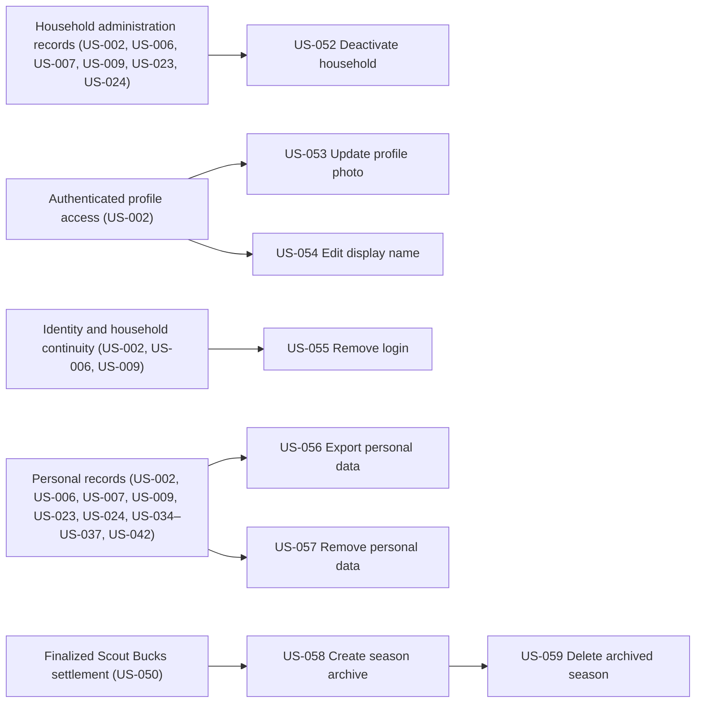

# Administration, Profiles, Privacy & Season Lifecycle

## Goal

Support safe household administration, profile self-service, clearly separated access and privacy actions, and deliberate encrypted archival and deletion of completed seasons.

## Source use cases

- [UC-5 — Family Becomes Inactive](../../use-cases.md#use-case-5-family-becomes-inactive)
- [UC-45 — User Updates Profile Photo](../../use-cases.md#use-case-45-user-updates-profile-photo)
- [UC-46 — User Edits Display Name](../../use-cases.md#use-case-46-user-edits-display-name)
- [UC-47 — Authenticated Person Removes Own Login](../../use-cases.md#use-case-47-authenticated-person-removes-own-login)
- [UC-48 — User Requests Data Export](../../use-cases.md#use-case-48-user-requests-data-export)
- [UC-49 — User Requests Permanent Data Removal](../../use-cases.md#use-case-49-user-requests-permanent-data-removal)
- [UC-56 — Admin Archives and Deletes a Completed Season](../../use-cases.md#use-case-56-admin-archives-and-deletes-a-completed-season)

## Actors

- Admin
- Authenticated person and Family Manager
- Current or former user, verified parent/guardian, and Privacy Contact

## Stories

- [US-052 — Deactivate a household](us-052-deactivate-a-household.md)
- [US-053 — Update profile photo](us-053-update-profile-photo.md)
- [US-054 — Edit display name](us-054-edit-display-name.md)
- [US-055 — Remove own login access](us-055-remove-own-login-access.md)
- [US-056 — Fulfill personal data export](us-056-fulfill-personal-data-export.md)
- [US-057 — Fulfill permanent data removal](us-057-fulfill-permanent-data-removal.md)
- [US-058 — Create encrypted completed-season archive](us-058-create-encrypted-completed-season-archive.md)
- [US-059 — Delete an archived completed season](us-059-delete-an-archived-completed-season.md)

## Dependencies

- US-002 provides authenticated identities and re-authentication.
- US-006, US-007, and US-009 provide household, profile, relationship, and access records.
- US-023 and US-024 provide assignment ownership affected by deactivation and privacy workflows.
- US-034 through US-037 provide immutable attendance and corrections.
- US-042 provides announcement and delivery records included in privacy and archive operations.
- US-058 requires finalized reporting from US-050 and a completed inactive season.
- US-059 requires a successful US-058 archive.

## Story dependency view

Arrows run from each hard prerequisite to the story that depends on it. Each story's **Dependencies** section is authoritative.

