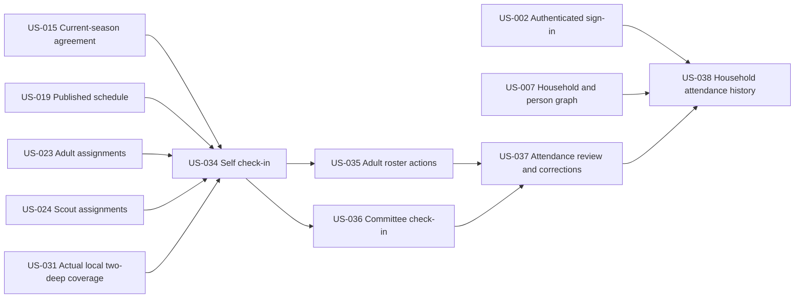

# Attendance & On-Site Roster

## Goal

Capture real-time attendance through authorized, time-bounded roster actions; expose current attendance to on-site volunteers; and preserve immutable events while allowing separate, reasoned, audited corrections after a shift.

Check-in and checkout use server time. The selected participant's current agreement confirmation is revalidated for check-in, and scout check-in is governed by the actual local two-deep evaluator specified by US-031.

## Source use cases

- [UC-27](../../use-cases.md#use-case-27-authenticated-volunteer-checks-self-in)
- [UC-28](../../use-cases.md#use-case-28-working-adult-checks-in-another-volunteer)
- [UC-29](../../use-cases.md#use-case-29-committee-checks-in-an-arriving-volunteer)
- [UC-30](../../use-cases.md#use-case-30-working-adult-checks-out-another-volunteer)
- [UC-31](../../use-cases.md#use-case-31-committee-reviews-shift-attendance)
- [UC-32](../../use-cases.md#use-case-32-family-manager-views-attendance-history)
- [UC-53](../../use-cases.md#use-case-53-agreement-confirmation-blocks-participation)
- [UC-58](../../use-cases.md#use-case-58-system-enforces-the-local-two-deep-coverage-rule-during-a-shift)

## Actors

- Family Manager
- Young Adult Scout
- Authenticated Adult Volunteer
- Committee Member
- Admin
- Managed Scout and other arriving volunteers

## Stories

- [US-034 — Check self in](us-034-check-self-in.md)
- [US-035 — Checked-in adult checks another volunteer in/out](us-035-checked-in-adult-checks-another-volunteer-in-out.md)
- [US-036 — Committee checks in arriving volunteer](us-036-committee-checks-in-arriving-volunteer.md)
- [US-037 — Review and correct attendance/no-shows](us-037-review-and-correct-attendance-no-shows.md)
- [US-038 — View household attendance history](us-038-view-household-attendance-history.md)

## Dependencies

- US-015 — Current-season agreement policy
- US-019 — Published schedule
- US-023 and US-024 — Adult and scout assignments
- US-031 — Actual local two-deep policy; attendance actions exercise its evaluator
- US-037 depends on US-034, US-035, and US-036
- US-038 depends on finalized attendance and correction behavior from US-037

## Story dependency view

The incoming assignment capabilities establish projected participation, while US-031 evaluates actual on-site coverage from the attendance events created here. Each story's **Dependencies** section is authoritative.

