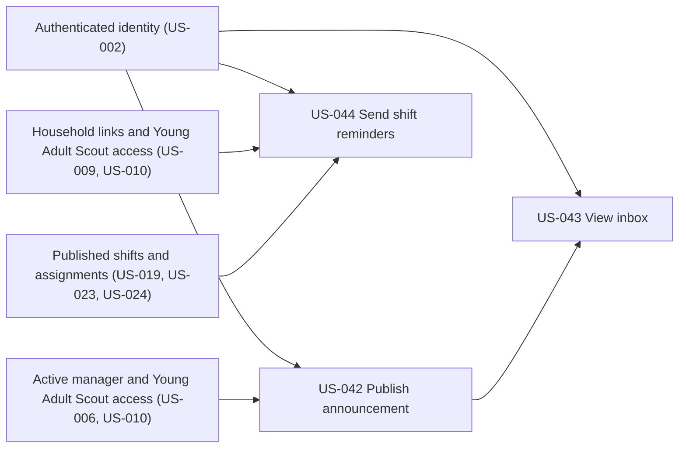

# Communications & Reminders

## Goal

Keep active troop participants informed through a canonical in-app inbox, private read state, optional Groups.io posts for troop-wide messages, and correctly routed shift reminders.

## Source use cases

- [UC-4 — Committee Sends Announcement](../../use-cases.md#use-case-4-committee-sends-announcement)
- [UC-4A — Authenticated User Views In-App Inbox](../../use-cases.md#use-case-4a-authenticated-user-views-in-app-inbox)
- [UC-6 — Shift Reminders (Automated)](../../use-cases.md#use-case-6-shift-reminders-automated)

## Actors

- Committee Member and Admin
- Family Manager
- Young Adult Scout
- Automated reminder worker

## Stories

- [US-042 — Publish and deliver troop announcement](us-042-publish-and-deliver-troop-announcement.md)
- [US-043 — View and mark inbox messages read](us-043-view-and-mark-announcements-read.md)
- [US-044 — Send automated shift reminders](us-044-send-automated-shift-reminders.md)

## Dependencies

- US-002 provides authenticated identities.
- US-006 establishes active household managers, and US-010 establishes Young Adult Scout access used for recipient selection.
- US-019 provides published shifts.
- US-023 and US-024 provide household-owned and Young Adult Scout-created assignments used by reminder routing.
- US-043 requires US-042's canonical announcements.

## Story dependency view

Arrows run from each hard prerequisite to the story that depends on it. Each story's **Dependencies** section is authoritative.

