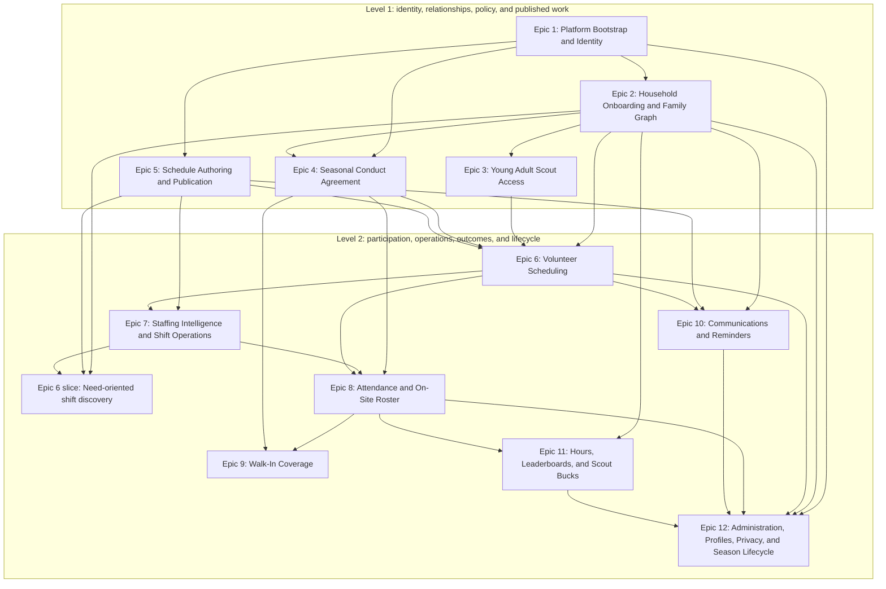

# User-story dependencies

## How to read this map

A **hard prerequisite** is a capability or authoritative record that must exist before a dependent story can satisfy its acceptance criteria through the real system boundary. This diagram is a two-level capability overview, not a delivery plan: it groups all 12 epics into foundation and participation/operations levels and shows only major hard cross-epic gates. Use the [recommended incremental roadmap](roadmap.md) as the primary delivery visualization.

Arrows point from prerequisite capability to dependent capability. An edge means at least one story in the dependent epic has a hard prerequisite in the source epic; it does not mean every story in one epic must precede every story in the other. Fine-grained dependencies, including dependencies intentionally omitted here, remain authoritative in each individual story's **Dependencies** section. Follow the linked epic README, then its story list, for that epic's per-story mini-graph.

Enhancements and shared infrastructure are omitted. The deployable application, PostgreSQL transactions, audit storage, outbox, injected clock, and provider stubs are established by the roadmap's technical-enabler increment rather than by a numbered product story.

## Epic guide and per-epic mini-graphs

Mermaid links are intentionally disabled. Use these links outside the diagram. Each epic README is the entry point to its story list; the linked stories' authoritative **Dependencies** sections form the detailed per-epic mini-graph.

1. [Epic 1: Platform Bootstrap and Identity](platform-bootstrap-identity/)
2. [Epic 2: Household Onboarding and Family Graph](household-onboarding-family-graph/)
3. [Epic 3: Young Adult Scout Access](young-adult-scout-access/)
4. [Epic 4: Seasonal Conduct Agreement](seasonal-conduct-agreement/)
5. [Epic 5: Schedule Authoring and Publication](schedule-authoring-publication/)
6. [Epic 6: Volunteer Scheduling](volunteer-scheduling/)
7. [Epic 7: Staffing Intelligence and Shift Operations](staffing-intelligence-shift-operations/)
8. [Epic 8: Attendance and On-Site Roster](attendance-on-site-roster/)
9. [Epic 9: Walk-In Coverage](walk-in-coverage/)
10. [Epic 10: Communications and Reminders](communications-reminders/)
11. [Epic 11: Hours, Leaderboards, and Scout Bucks](hours-leaderboards-scout-bucks/)
12. [Epic 12: Administration, Profiles, Privacy, and Season Lifecycle](administration-profiles-privacy-season-lifecycle/)

## Cross-cutting policy notes

- **Seasonal agreement:** US-015 is the single participation-eligibility policy consumed by signup, assignment, check-in, and walk-in commands. Eligibility is for the selected person, season, and current link; replacing the link resets confirmations, and Committee/Admin cannot override the gate.
- **Multi-household behavior:** One person profile and one schedule span linked households. Household origin controls manager cancellation, except that Young Adult Scout-created assignments can be managed by the scout and managers of any linked household. Reporting deduplicates people through explicit family units and person-level adult-to-scout relationships.
- **Projected versus actual coverage:** US-029 and US-030 derive projected status from active assignments. US-031 derives actual operating safety from open attendance records. A safe projection never proves the lot may operate, and the local adult classification does not prove national-policy leader eligibility.
- **Attendance and reporting:** Real-time events use server time and remain immutable. US-037 adds reasoned, audited corrections; downstream history, leaderboards, statistics, Scout Bucks, privacy exports, and archives consume corrected outcomes while retaining source events.
- **Communications and outbox:** Canonical web records, per-recipient SMS, and optional Groups.io deliveries are independent. State changes and outbox records commit together; provider calls happen afterward and are idempotent. Groups.io is disabled by default and never blocks core web or SMS outcomes.
- **Authorization boundaries:** An authenticated identity is distinct from a person profile and may hold several roles. Every command re-evaluates role, person, household authority, assignment ownership, active state, agreement eligibility, shift state, timing, and audited override authority as applicable; submitted IDs and hidden controls never establish authority.
- **Access, privacy, and lifecycle:** Removing login access, deactivating a household, permanently removing personal data, and deleting an archived season are separate operations. Profile and historical records survive access removal; privacy fulfillment is separately verified; season deletion requires a current successful encrypted archive and removes only season-owned data.

## Dependency boundary decisions

- US-002 defines reusable sign-in and session behavior. US-006 uses that capability while redeeming the first Family Manager's invitation, so the dependency runs from US-002 to US-006.
- US-027 presents projected staffing but does not calculate it, so US-029's projected staffing read model is a hard prerequisite. The overview separates need-oriented discovery from Epic 6's assignment workflows, avoiding a misleading epic-level cycle while preserving both dependency directions at story level.
- US-039 uses Committee roster authority from US-036 and may mark the retained assignment No Show only after the check-in window closes. Post-shift review in US-037 is not a prerequisite.
