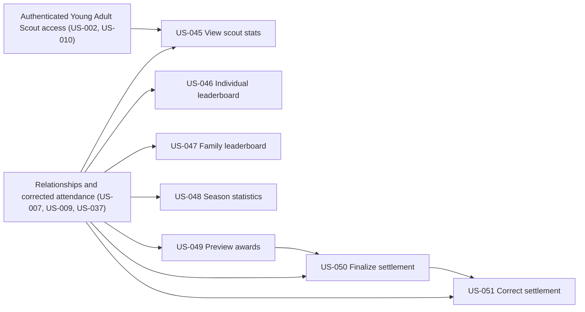

# Hours, Leaderboards & Scout Bucks

## Goal

Turn corrected attendance and explicit relationships into privacy-appropriate statistics, deduplicated rankings, and exact, auditable Scout Bucks settlements.

## Source use cases

- [UC-36 — Scout Hours and Stats Are Viewed](../../use-cases.md#use-case-36-scout-hours-and-stats-are-viewed)
- [UC-37 — Family Manager Views Individual Leaderboard](../../use-cases.md#use-case-37-family-manager-views-individual-leaderboard)
- [UC-38 — Family Manager Views Family Leaderboard](../../use-cases.md#use-case-38-family-manager-views-family-leaderboard)
- [UC-39 — Committee Views Season Statistics](../../use-cases.md#use-case-39-committee-views-season-statistics)
- [UC-40 — Treasurer Finalizes Scout Bucks Awards](../../use-cases.md#use-case-40-treasurer-finalizes-scout-bucks-awards)

## Actors

- Family Manager and Young Adult Scout
- Committee Member and Admin
- Treasurer

## Stories

- [US-045 — View scout hours and stats](us-045-view-scout-hours-and-stats.md)
- [US-046 — View individual leaderboard](us-046-view-individual-leaderboard.md)
- [US-047 — View family leaderboard](us-047-view-family-leaderboard.md)
- [US-048 — View committee season statistics](us-048-view-committee-season-statistics.md)
- [US-049 — Review Scout Bucks inputs and preview awards](us-049-review-scout-bucks-inputs-and-preview-awards.md)
- [US-050 — Finalize and export Scout Bucks settlement](us-050-finalize-and-export-scout-bucks-settlement.md)
- [US-051 — Issue corrected Scout Bucks revision](us-051-issue-corrected-scout-bucks-revision.md)

## Dependencies

- US-007 and US-009 provide explicit person, household, family-unit, and adult-to-scout relationships.
- US-037 provides corrected attendance while preserving immutable source events.
- US-050 requires the reviewed preview from US-049.
- US-051 requires an immutable finalized settlement from US-050.

## Story dependency view

Arrows run from each hard prerequisite to the story that depends on it. Each story's **Dependencies** section is authoritative.

