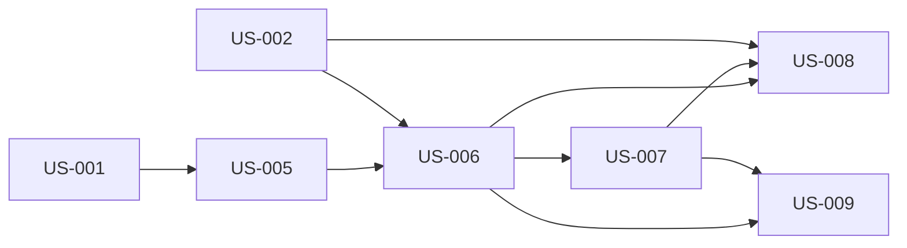

# Household Onboarding and Family Graph

## Goal

Onboard invitation-only households and represent managers, person profiles, explicit adult-to-scout relationships, and shared scouts without duplicating people or weakening household management boundaries.

## Source use cases

- [UC-1: New Family Joins](../../use-cases.md#use-case-1-new-family-joins)
- [UC-7: Family Manager Adds Co-Manager](../../use-cases.md#use-case-7-family-manager-adds-co-manager)
- [UC-26: Divorced Parents - Scout in Two Households](../../use-cases.md#use-case-26-divorced-parents-scout-in-two-households)

## Actors

- Admin
- Primary Family Manager
- Existing Family Manager
- Co-parent or guardian
- Adult family member
- Scout
- Manager of another household

## Stories

1. [US-005: invite a new household](us-005-invite-a-new-household.md)
2. [US-006: redeem household invitation and create household](us-006-redeem-household-invitation-and-create-household.md)
3. [US-007: establish household members and explicit adult-scout relationships](us-007-establish-household-members-and-explicit-adult-scout-relationships.md)
4. [US-008: add a co-manager](us-008-add-a-co-manager.md)
5. [US-009: link a scout across households](us-009-link-a-scout-across-households.md)

## Story dependency view

Arrows run from each hard prerequisite to the story that depends on it. Each story's **Dependencies** section is authoritative.

## Cross-epic dependencies

- US-001 supplies the Admin authorized to issue new-household invitations.
- US-002 supplies passkey sign-in and personal sessions for managers.
- US-004 uses co-manager and manager-to-scout authority established in this epic for assisted recovery.
- US-010 grants optional Young Adult Scout access to an existing scout profile created here.
- US-011, US-013, and US-015 configure the agreement, confirm each participant, and unlock participation individually after onboarding.
