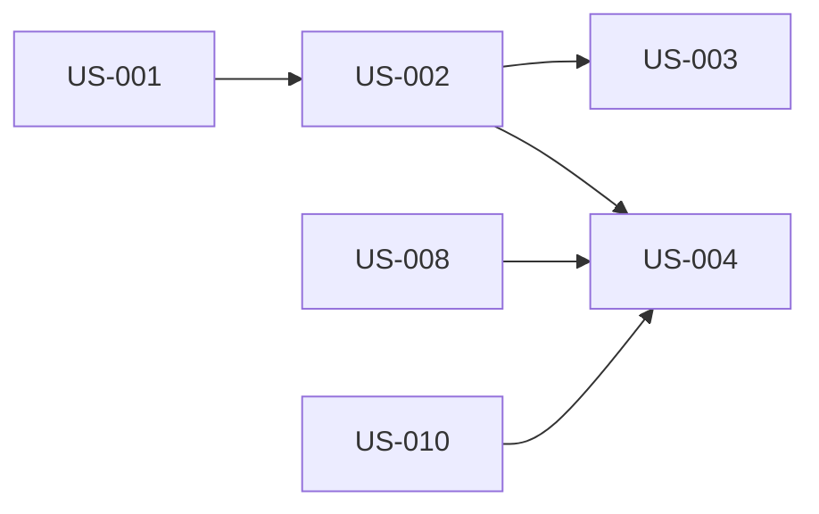

# Platform Bootstrap and Identity

## Goal

Establish the first administrator and provide secure, personal, passwordless access while preserving identity continuity when a login phone number changes or must be recovered.

## Source use cases

- [UC-0: Creating the First Administrator](../../use-cases.md#use-case-0-creating-the-first-administrator)
- [UC-2: Authenticated Family Member Signs In](../../use-cases.md#use-case-2-authenticated-family-member-signs-in)
- [UC-2B: Authenticated Person Changes Phone Number](../../use-cases.md#use-case-2b-authenticated-person-changes-phone-number)

## Actors

- Designated first Admin
- Technical setup person or designated technical operator
- Family Manager
- Young Adult Scout
- Committee Member
- Admin
- Authorized recovery actor

## Stories

1. [US-001: bootstrap first administrator](us-001-bootstrap-first-administrator.md)
2. [US-002: secure authenticated sign-in](us-002-secure-authenticated-sign-in.md)
3. [US-003: change own phone number](us-003-change-own-phone-number.md)
4. [US-004: recover another person's phone access](us-004-recover-another-persons-phone-access.md)

## Story dependency view

Arrows run from each hard prerequisite to the story that depends on it. Each story's **Dependencies** section is authoritative.

## Cross-epic dependencies

- US-005 and US-006 establish the invitation and household path through which the first Family Manager receives authenticated access.
- US-008 establishes co-manager authority used in Family Manager recovery.
- US-010 establishes Young Adult Scout access and the Family Manager recovery relationship for that access.
- US-011, US-013, and US-015 configure, record, and enforce the participation gate shown after sign-in; authentication itself occurs before confirmation.
