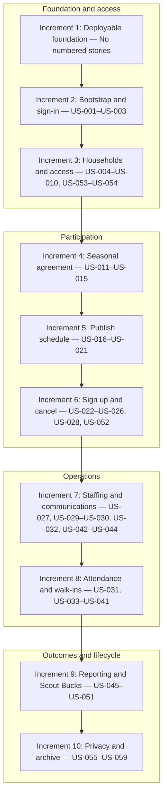

# Recommended incremental roadmap

This roadmap is a delivery recommendation, not a requirements document. [`docs/use-cases.md`](../use-cases.md) remains authoritative. This release train is the primary delivery visualization; the [dependency overview](dependencies.md) summarizes major cross-epic capability gates and is not delivery order. Individual story dependency sections remain authoritative for hard prerequisites. Increment boundaries may move as acceptance examples expose better slices, but stable story IDs and product policy do not change.

## Release train

Arrows show the recommended increment sequence. Rows group the train into readable stages; they do not introduce parallel delivery tracks.

## Current baseline

Increment 1 is verified. The repository provides production-shaped web, worker,
migration, and restore entry points; PostgreSQL migration, audit, outbox, job,
session, and CSRF foundations; and a deployed whole-system acceptance harness.
No numbered user-story product behavior, passkey authentication, or
relationship-aware authorization is implemented yet. The generated
[traceability report](../traceability.md) records the current requirement
revisions and delivery evidence.

Each increment below is intended to be independently deployable. “Exit” means its business-facing executable examples pass against the deployed production image through public browser/HTTP or provider boundaries; focused tests also cover the stated authorization, concurrency, timing, audit, and idempotency risks.

## INC-01 — Deployable application foundation and acceptance harness

**User-visible outcome:** Operators can deploy a production-shaped web and worker application, observe readiness without exposing secrets, and run a minimal browser smoke journey. There is deliberately no numbered user-story behavior in this technical-enabler increment.

**Included stories:** None.

**Prerequisites:** Current Signal shell and liveness/static baseline.

**Operational and migration needs:**

- Add the Go web, worker, migration, and offline season-restore entry-point structure around the modular monolith.
- Provision PostgreSQL, versioned migrations, validated configuration, `TREE_LOT_TIME_ZONE`, `PUBLIC_BASE_URL`, structured logging, readiness, CSRF/session foundations, and production security headers.
- Build one immutable production image and a production-like acceptance environment with PostgreSQL, an injected test clock, and protocol-faithful optional Groups.io stubs.
- Establish transactional audit/outbox/job primitives, even though no provider message is sent yet.

**Acceptance-based exit:**

- The production image deploys with migrations applied only by the migration entry point; web and worker reject incompatible schema rather than mutating it.
- Liveness, readiness, static assets, server-rendered navigation, ordinary non-HTMX requests, and the acceptance test-control boundary behave correctly in allowed environments.
- A failing executable specification blocks the candidate build, and asynchronous test assertions poll observable outcomes without fixed sleeps.

## INC-02 — Bootstrap and sign-in

**User-visible outcome:** The designated first Admin can bootstrap exactly once with a passkey, authenticated people can sign in with passkeys, and a signed-in person can manage passkeys and claimed account email without losing identity or history.

**Included stories:** US-001, US-002, US-003.

**Prerequisites:** Increment 1; configured bootstrap enrollment token and WebAuthn relying-party settings.

**Operational and migration needs:**

- Add identities, roles, claimed email identifiers, passkey public credential records, hashed session tokens, revocation metadata, bootstrap closure, rate-limit state, and audit records.
- Configure secure host-only cookies, WebAuthn relying-party ID/origin, and redacted authentication telemetry.
- Provide a safe initial-Admin operating procedure and a separate future break-glass design without exposing it as ordinary bootstrap.

**Acceptance-based exit:**

- UC-0, UC-2, and the self-service path of UC-2B pass for success, failed/cancelled WebAuthn ceremonies, identity-enumeration resistance, rate limiting, secure session revocation, bootstrap closure, passkey management, and atomic email replacement.
- The same identity, profile reference, roles, and history survive credential and email changes.

## INC-03 — Household onboarding and Young Adult Scout access

**User-visible outcome:** Admin can invite a household by link or QR code; its first manager can establish people and explicit relationships, add a co-manager, link one scout across households, grant limited Young Adult Scout access, perform authorized assisted passkey recovery, and let authenticated people maintain basic profile details.

**Included stories:** US-004, US-005, US-006, US-007, US-008, US-009, US-010, US-053, US-054.

**Prerequisites:** US-001 and the reusable authentication/session capability from US-002.

**Operational and migration needs:**

- Add people, households, memberships, manager authority, family units, explicit adult-to-scout relationships, purpose-bound hashed invitation/link tokens, and Young Adult Scout identity links.
- Add PostgreSQL `BYTEA` profile blobs behind `BlobStore`, including image validation, re-encoding, size limits, and lifecycle metadata.
- Support out-of-band invitation link and QR presentation; add expiry and idempotency cleanup policies.
- Define and secure the operator-only break-glass recovery procedure before relying on the no-active-Admin branch.

**Acceptance-based exit:**

- UC-1, UC-2A, UC-2B assisted recovery, UC-7, UC-26, UC-45, and UC-46 pass through invitation and browser flows.
- Tests prove no open registration, global claimed-email uniqueness, no duplicate scout profile, no scout search, independent household authority, one cross-household schedule identity, self-only Young Adult Scout permissions, and audited recovery.
- Relationship and invitation authorization is identical for full-page and HTMX-enhanced requests.

## INC-04 — Seasonal agreement

**User-visible outcome:** Admin configures the current public agreement; participants can open and explicitly confirm it; leaders can review readiness; and one person-level policy gates all later participation.

**Included stories:** US-011, US-012, US-013, US-014, US-015.

**Prerequisites:** US-002, US-006, US-007, and US-009.

**Operational and migration needs:**

- Add season agreement-link identity, per-person confirmation records, acting identity, server timestamps, and atomic reset behavior.
- Allow only approved public HTTPS Google Docs URLs; do not fetch, proxy, cache, or store document contents.
- Add audit facts for link replacement and confirmation changes without copying document content.

**Acceptance-based exit:**

- UC-50, UC-51, UC-53, UC-54, and UC-55 pass for self and facilitated confirmation, role-specific visibility, invalid links, replacement reset, and non-overridable denials.
- Confirmation is demonstrably scoped to person, season, and current link; opening a link alone never confirms.
- A shared policy query is executable by downstream acceptance fixtures without duplicating agreement rules.

## INC-05 — Author, publish, and discover a schedule

**User-visible outcome:** Committee can create templates, generate and refine a private season draft, publish it once ready, add an unplanned published shift, and navigate the relevant season and week.

**Included stories:** US-016, US-017, US-018, US-019, US-020, US-021.

**Prerequisites:** US-002 and the deployable outbox/worker foundation; participant recipient identities from increment 3 for publication inbox notices.

**Operational and migration needs:**

- Add seasons, reusable templates, generated shifts, local date/time plus zone conversion, draft/publication state, special-event metadata, target slots, and minimum operating headcount.
- Persist publication and individual-shift inbox notice records for eligible recipients, plus optional Groups.io outbox messages with stable idempotency keys for troop-wide summaries when that channel is selected.
- Treat the personal Inbox UI, unread counts, and announcement/reminder workflows as increment 7; this increment only needs durable notice records and optional Groups.io fan-out so publication does not depend on SMS.
- Seed no production schedule automatically; Committee authors the first season through normal workflows.

**Acceptance-based exit:**

- UC-3, UC-20 through UC-24, and UC-44 pass for template independence, closed-day exceptions, draft privacy, atomic publication, one optional summary inbox notice per recipient, immediate individual publication, and off-season/draft navigation.
- Minimum headcount below two is rejected, and no template or shift can configure away local two-deep policy.
- Groups.io failure cannot roll back web publication or inbox notice records; draft operations send no messages.

## INC-06 — Sign up and cancel

**User-visible outcome:** Managers and Young Adult Scouts can discover suitable published shifts, create valid assignments for the correct person, coordinate a shared scout, and cancel only within origin-aware authority; Admin can deactivate a household that should no longer participate.

**Included stories:** US-022, US-023, US-024, US-025, US-026, US-028, US-052.

**Prerequisites:** US-009, US-010, US-015, US-019, and US-021.

**Operational and migration needs:**

- Add assignment origin/ownership, actor attribution, role-slot constraints, one-person-per-shift uniqueness, cancellation state, and capacity-safe conditional updates or row locking.
- Add per-household inactivity state that blocks new participation without deleting people, history, or access retained through other households.
- Add assignment audit facts and projected-staffing recalculation events.
- Prepare concurrency-capable acceptance fixtures for simultaneous attempts at the final slot.

**Acceptance-based exit:**

- UC-5, UC-8 through UC-19, UC-25, UC-26, and signup aspects of UC-53 pass for managers, managed scouts, Young Adult Scouts, inactive households, special events, and linked households.
- Concurrent final-slot requests never overbook; duplicate and wrong-role assignments are rejected server-side.
- Visibility spans linked households while cancellation follows origin, including the Young Adult Scout-created exception and idempotent cancellation.

## INC-07 — Projected staffing and communications

**User-visible outcome:** Managers can discover shifts by need; Committee can see projected staffing risks and send reliable troop announcements and critical coverage alerts; users can manage a private in-app inbox with read state; and the system places correctly routed shift reminders in recipients' inboxes.

**Included stories:** US-027, US-029, US-030, US-032, US-042, US-043, US-044.

**Prerequisites:** Published schedules and assignments from increments 5–6; household and Young Adult Scout recipient relationships from increment 3.

**Operational and migration needs:**

- Add projected staffing read models, canonical announcements, the personal Inbox UI over per-user inbox messages (including any notices already recorded in increment 5), private per-identity read state, recipient snapshots, optional Groups.io delivery attempts, retries, reminder preferences, and hourly enqueue jobs.
- Keep `GROUPS_IO_ENABLED=false` by default. Add its adapter/configuration tests independently; unavailable Groups.io must not block this increment.
- Limit Groups.io to troop-wide messages; keep direct and family-scoped reminders in-app only. Do not introduce SMS or phone-number notification delivery.
- Leave verified-email notification delivery out of this increment; mailbox verification and opt-in email remain a later follow-on.

**Acceptance-based exit:**

- UC-4, UC-4A, UC-6, UC-41, UC-42, UC-43, and UC-57 pass for need-oriented discovery, projected FULL/OK/LOW/CRITICAL classification, prioritized shortfalls, in-app inbox publication, private unread counts, origin-aware reminders, critical alerts, deduplicated resolution updates, and partial external-channel failure.
- Every state change commits inbox records and any outbox work atomically, provider calls occur afterward, and retries duplicate neither messages nor successful channel outcomes.
- Projected status is explicitly not represented as actual on-site safety.

## INC-08 — Attendance, actual coverage, closure, and walk-ins

**User-visible outcome:** Volunteers and authorized on-site adults can record real-time attendance, actual local two-deep safety is enforced, Committee can close unsafe shifts and correct completed attendance, and eligible walk-ins receive distinct credit.

**Included stories:** US-031, US-033, US-034, US-035, US-036, US-037, US-038, US-039, US-040, US-041.

**Prerequisites:** US-015, US-019, US-023, US-024, US-030, US-032, and the server clock/test-control foundation.

**Operational and migration needs:**

- Add immutable attendance events, open-record constraints, no-shows, separate adjustments, walk-in origin, actual-coverage transitions, closure/reopening state, reasons, and urgent operational inbox notices with optional Groups.io outbox posts for troop-wide closure/reopening updates.
- Store instants in UTC and evaluate check-in/out windows in `TREE_LOT_TIME_ZONE` using an injected clock.
- Document that local adult classification does not verify Scouting America registration, age, training, or leader eligibility; Committee retains that operational responsibility.

**Acceptance-based exit:**

- UC-27 through UC-35, UC-53, UC-58, and UC-59 pass at exact window boundaries for self, checked-in adult, handoff adult, Committee, no-show replacement, extra scout, and prior-shift extension paths.
- Scout entry is denied until two adults are checked in; adult checkout is never blocked but triggers stop-work/closure-required behavior when safety falls.
- Raw events cannot be edited or backdated; reasoned adjustments govern corrected hours; closure is explicit, audited, communicated, and only pre-start safe closure may reopen.

## INC-09 — Reporting and Scout Bucks

**User-visible outcome:** Authorized users can review corrected hours and deduplicated rankings, Committee can inspect season outcomes, and Treasurer can preview, finalize, export, and revise exact Scout Bucks awards.

**Included stories:** US-045, US-046, US-047, US-048, US-049, US-050, US-051.

**Prerequisites:** US-007, US-009, and finalized correction behavior from US-037; staffing/closure facts from increments 7–8 for season statistics.

**Operational and migration needs:**

- Add reporting projections, explicit family-unit composition review, full-precision credited-hour calculations, immutable settlement revisions, integer-cent allocation, and revision-aware CSV export.
- Establish a completed-season transition and Treasurer/Admin authorization.
- Preserve reproducible snapshots so later attendance or relationship changes do not mutate a finalized revision.

**Acceptance-based exit:**

- UC-36 through UC-40 pass for privacy boundaries, corrected scheduled/walk-in hours, multi-household deduplication, explicit family units, adult-hour attribution, zero-hours rejection, and season statistics.
- Deterministic largest-remainder allocation makes every revision sum exactly to the entered pool; repeated finalization cannot create an accidental duplicate.
- Prior revisions remain immutable and auditable, and the scheduler creates no Scout Bucks balance or spending ledger.

## INC-10 — Access removal, privacy, and season archive

**User-visible outcome:** People can remove login access without erasing history; Admin can fulfill separately verified privacy requests and deliberately archive then delete a completed season.

**Included stories:** US-055, US-056, US-057, US-058, US-059.

**Prerequisites:** All authoritative identity, household, schedule, assignment, attendance, communication, reporting, and settlement records from increments 2–9; US-059 specifically requires a current successful US-058 archive.

**Operational and migration needs:**

- Add privacy-request workflow state and non-identifying fulfillment evidence.
- Build complete portable exports and coordinated deletion/anonymization across bounded contexts without leaking contents to logs.
- Add versioned archive manifests, checksums, passphrase-based `age` encryption, browser download, deletion receipts, and a tested offline restore command. The application never stores the passphrase.
- Write operator runbooks for privacy verification, archive/passphrase custody, restore drills, and the difference between login removal, household deactivation, personal deletion, and season deletion.

**Acceptance-based exit:**

- UC-47 through UC-49 and UC-56 pass for relationship-aware authorization, continuity checks, separately verified requests, atomic deletion, report impact, and retained non-identifying evidence.
- Login removal preserves profile/history; household deactivation preserves unrelated access; permanent removal deletes or anonymizes personal data; season deletion removes only exclusively season-owned data.
- A completed season cannot be deleted until a current verified encrypted archive exists, passkey step-up re-authentication and explicit confirmations pass, and archive round-trip restoration succeeds in an offline acceptance exercise.

## Story coverage check

The increments include every stable story exactly once: US-001–US-003 in increment 2; US-004–US-010 and US-053–US-054 in 3; US-011–US-015 in 4; US-016–US-021 in 5; US-022–US-026, US-028, and US-052 in 6; US-027, US-029, US-030, US-032, and US-042–US-044 in 7; US-031 and US-033–US-041 in 8; US-045–US-051 in 9; and US-055–US-059 in 10.
