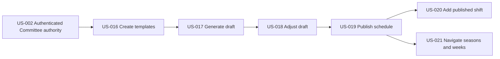

# Schedule Authoring and Publication

## Goal

Let authorized committee leaders define reusable shift patterns, generate and refine a private draft, publish the season once ready, and navigate or extend the published schedule.

## Source use cases

- [UC-3, UC-20, UC-21, UC-22, UC-23, UC-24, and UC-44](../../use-cases.md)

## Actors

- Committee Member
- Committee Chair
- Admin
- Any authenticated user

## Stories

- [US-016 Create shift templates](us-016-create-shift-templates.md)
- [US-017 Generate draft season schedule](us-017-generate-draft-season-schedule.md)
- [US-018 Review and adjust draft schedule](us-018-review-and-adjust-draft-schedule.md)
- [US-019 Publish season schedule](us-019-publish-season-schedule.md)
- [US-020 Add an individual published shift](us-020-add-an-individual-published-shift.md)
- [US-021 Navigate seasons and weeks](us-021-navigate-seasons-and-weeks.md)

## Story dependency view

Arrows run from each hard prerequisite to the story that depends on it. Each story's **Dependencies** section is authoritative.

## Cross-epic dependencies

- US-002 provides authenticated Committee, Admin, and schedule-viewer identities.
- Published schedule stories provide the schedule required by the volunteer-scheduling epic.
- The authoring flow is US-016 → US-017 → US-018 → US-019; US-020 and US-021 depend on US-019.
