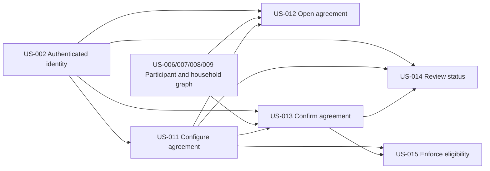

# Seasonal Conduct Agreement

## Goal

Ensure every participant can review the current season's externally maintained rules of conduct, explicitly confirm them, and be prevented from participating until eligible.

## Source use cases

- [UC-50, UC-51, UC-53, UC-54, and UC-55](../../use-cases.md)

## Actors

- Admin
- Committee Member
- Family Manager
- Adult family member
- Managed Scout
- Young Adult Scout
- System

## Stories

- [US-011 Configure seasonal agreement link](us-011-configure-seasonal-agreement-link.md)
- [US-012 Open current agreement from profile](us-012-open-current-agreement-from-profile.md)
- [US-013 Confirm agreement for a participant](us-013-confirm-agreement-for-a-participant.md)
- [US-014 Review confirmation status](us-014-review-confirmation-status.md)
- [US-015 Enforce participation eligibility](us-015-enforce-participation-eligibility.md)

## Story dependency view

Arrows run from each hard prerequisite to the story that depends on it. Each story's **Dependencies** section is authoritative.

## Cross-epic dependencies

- US-002 provides authenticated identities for actors who configure, review, facilitate, or personally submit confirmations.
- US-006 provides participant profiles.
- US-006 and US-008 provide manager authority; US-007 and US-009 provide household relationships used for profile access and facilitated confirmation.
