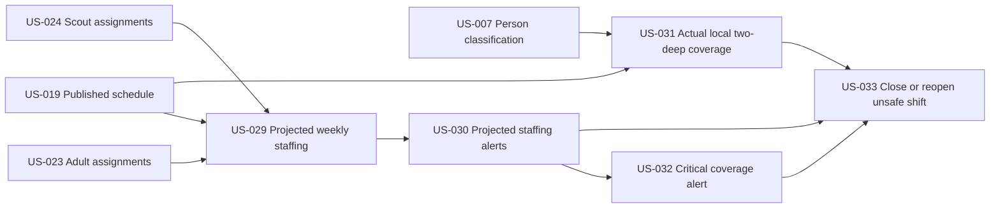

# Staffing Intelligence & Shift Operations

## Goal

Give Committee and Admin users a reliable view of projected staffing, urgent coverage risks, actual on-site two-deep compliance, and the audited actions needed to alert volunteers or close an unsafe shift.

Projected coverage is calculated from active assignments. Actual coverage is calculated from current, immutable attendance events. A safe projection does not prove that the lot may operate, and local adult counts do not prove compliance with Scouting America's national adult-leadership requirements.

## Source use cases

- [UC-41](../../use-cases.md#use-case-41-committee-views-week-schedule-with-staffing-levels)
- [UC-42](../../use-cases.md#use-case-42-committee-reviews-staffing-alerts-dashboard)
- [UC-57](../../use-cases.md#use-case-57-committee-sends-a-critical-coverage-alert)
- [UC-58](../../use-cases.md#use-case-58-system-enforces-the-local-two-deep-coverage-rule-during-a-shift)
- [UC-59](../../use-cases.md#use-case-59-committee-closes-a-shift-for-insufficient-coverage)

## Actors

- Committee Member
- Admin
- Assigned adults and scouts
- System

## Stories

- [US-029 — View weekly staffing levels](us-029-view-weekly-staffing-levels.md)
- [US-030 — Review staffing alerts dashboard](us-030-review-staffing-alerts-dashboard.md)
- [US-031 — Enforce actual local two-deep coverage](us-031-enforce-actual-local-two-deep-coverage.md)
- [US-032 — Send critical coverage alert](us-032-send-critical-coverage-alert.md)
- [US-033 — Close or reopen unsafe shift](us-033-close-or-reopen-unsafe-shift.md)

## Dependencies

- US-019 — Published schedule
- US-023 and US-024 — Adult and scout assignment capabilities
- US-034 — Exercises the actual-coverage evaluator through real-time attendance, but is not a prerequisite for US-031; US-031 is the policy prerequisite for attendance stories
- US-030 is a prerequisite for US-032
- US-030 and US-032 are prerequisites for US-033; US-031 also supplies its actual-coverage policy

## Story dependency view

Projected staffing derives from active assignments; actual operating coverage derives from attendance. The two paths meet only when an unsafe shift may need to be closed. Each story's **Dependencies** section is authoritative.

