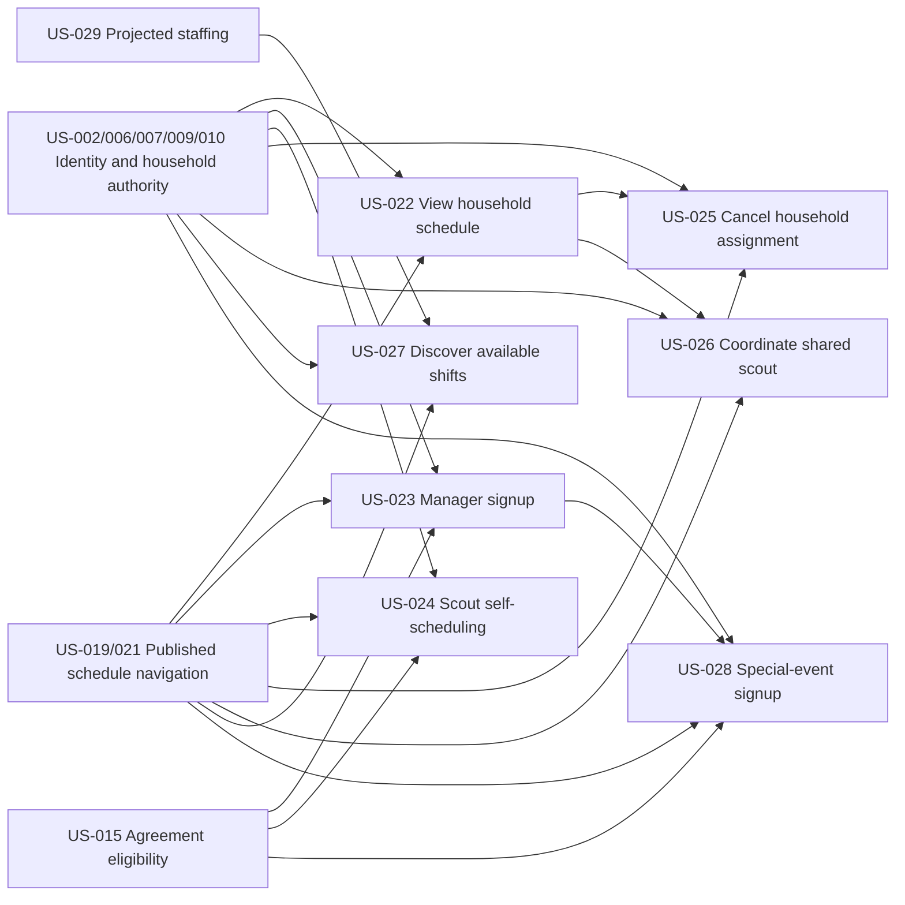

# Volunteer Scheduling

## Goal

Help households and Young Adult Scouts discover published shifts, create valid assignments, coordinate shared scouts, and cancel assignments only within their authority.

## Source use cases

- [UC-8 through UC-19, UC-25, UC-26, UC-43, and UC-53](../../use-cases.md)

## Actors

- Family Manager
- Young Adult Scout
- Managed Scout
- Adult family member
- Committee Member
- Admin
- System

## Stories

- [US-022 View household schedule](us-022-view-household-schedule.md)
- [US-023 Manager signs up household members](us-023-manager-signs-up-household-members.md)
- [US-024 Young Adult Scout self-schedules](us-024-young-adult-scout-self-schedules.md)
- [US-025 Cancel a household-owned adult/scout assignment](us-025-cancel-a-household-owned-adult-scout-assignment.md)
- [US-026 Coordinate a shared scout assignment](us-026-coordinate-a-shared-scout-assignment.md)
- [US-027 Discover available shifts in week view](us-027-discover-available-shifts-in-week-view.md)
- [US-028 Sign up for a special event](us-028-sign-up-for-a-special-event.md)

## Story dependency view

Arrows run from each hard prerequisite to the story that depends on it. Each story's **Dependencies** section is authoritative.

## Cross-epic dependencies

- US-002 provides authenticated Family Manager and Young Adult Scout identities.
- US-006 and US-008 establish manager authority; US-007 and US-009 provide household membership and shared-scout relationships.
- US-015 provides person-level agreement eligibility.
- US-019 and US-021 provide the published schedule and its season/week navigation.
