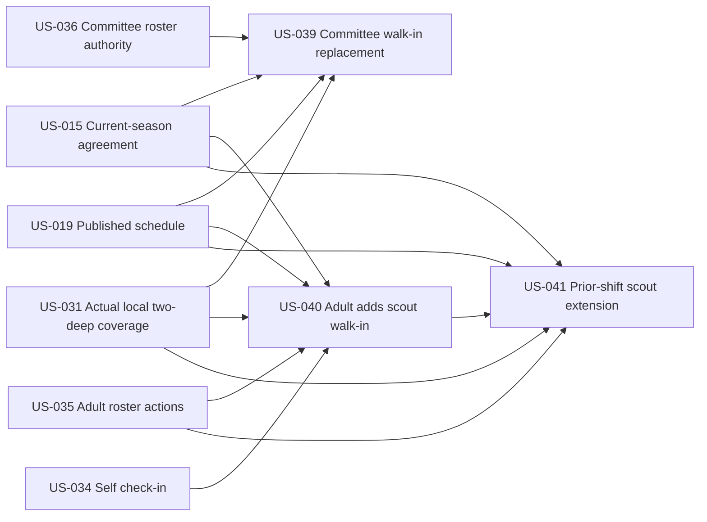

# Walk-In Coverage

## Goal

Let authorized on-site adults record eligible unscheduled volunteers in real time, including replacements for no-shows and scouts extending from a prior shift, while preserving agreement, actual local two-deep, audit, and attendance rules.

Walk-ins exist only for an in-progress shift, are checked in immediately at server time, and remain distinct from scheduled assignments in attendance and reporting.

## Source use cases

- [UC-33](../../use-cases.md#use-case-33-walk-in-covers-for-no-show)
- [UC-34](../../use-cases.md#use-case-34-checked-in-authenticated-adult-adds-walk-in-scout)
- [UC-35](../../use-cases.md#use-case-35-scout-from-prior-shift-extends-as-walk-in)
- [UC-53](../../use-cases.md#use-case-53-agreement-confirmation-blocks-participation)
- [UC-58](../../use-cases.md#use-case-58-system-enforces-the-local-two-deep-coverage-rule-during-a-shift)

## Actors

- Committee Member
- Admin
- Checked-In Authenticated Adult
- Adult or scout walk-in
- Prior-shift scout

## Stories

- [US-039 — Committee records walk-in covering no-show](us-039-committee-records-walk-in-covering-no-show.md)
- [US-040 — Checked-in adult adds walk-in scout](us-040-checked-in-adult-adds-walk-in-scout.md)
- [US-041 — Prior-shift scout extends as walk-in](us-041-prior-shift-scout-extends-as-walk-in.md)

## Dependencies

- US-015 — Current-season agreement policy
- US-019 — Published schedule
- US-031 — Actual local two-deep policy
- US-035 and US-036 — Relevant real-time roster capabilities
- US-039 uses Committee roster authority from US-036
- US-040 uses checked-in adult roster authority from US-035
- US-041 depends on US-035 and US-040 for prior-shift checkout and next-shift walk-in handling

## Story dependency view

Walk-ins create actual attendance for an in-progress shift. They consume the actual-coverage policy rather than projected staffing status. Each story's **Dependencies** section is authoritative.

