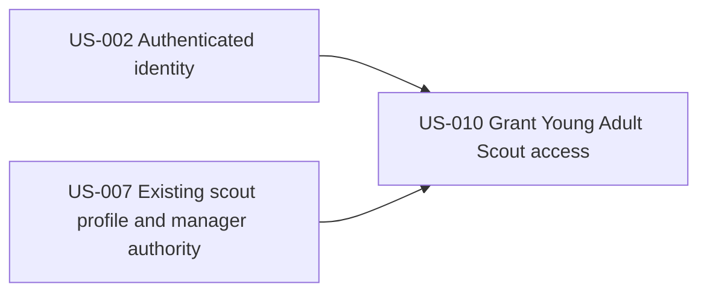

# Young Adult Scout Access

## Goal

Grant an older scout limited personal access through their own passkey login while retaining the scout's existing profile, household links, single schedule, and Family Manager oversight.

## Source use cases

- [UC-2A: Older Scout Becomes a Young Adult Scout](../../use-cases.md#use-case-2a-older-scout-becomes-a-young-adult-scout)

## Actors

- Family Manager
- Admin
- Older Scout

## Stories

1. [US-010: grant Young Adult Scout access to an existing scout profile](us-010-grant-young-adult-scout-access-to-an-existing-scout-profile.md)

## Story dependency view

Arrows run from each hard prerequisite to the story that depends on it. Each story's **Dependencies** section is authoritative.

## Cross-epic dependencies

- US-002 provides passkey sign-in and personal authenticated sessions.
- US-007 provides the existing scout profile and household membership to which access is linked.
- US-009 ensures one identity and schedule continue across multiple linked households.
- US-004 uses Family Manager authority to recover a Young Adult Scout's access when no passkey remains.
- US-011, US-013, and US-015 configure the agreement, record confirmation, and enforce participation eligibility; access may be granted before confirmation.
